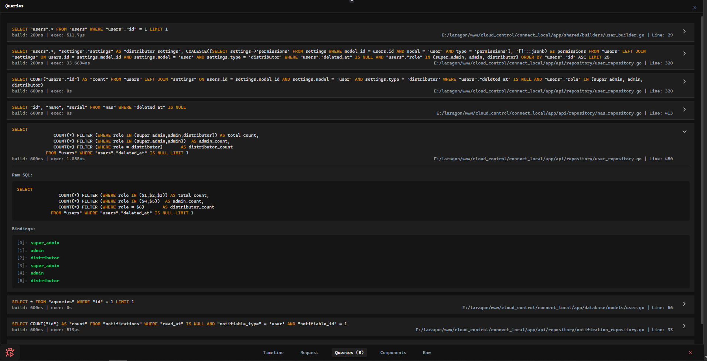

# XQB — SQL Query Builder for Go

A fluent, dialect-aware SQL query builder for Go. Build complex queries without writing raw SQL, and generate correct output for **MySQL** and **PostgreSQL** automatically.

## Installation

```bash
go get github.com/iMohamedSheta/xqb
```

## Quick Start

```go
package main

import (
    "database/sql"
    _ "github.com/go-sql-driver/mysql"
    "github.com/iMohamedSheta/xqb"
)

func main() {
    db, _ := sql.Open("mysql", "user:password@tcp(localhost:3306)/dbname")

    xqb.AddConnection(&xqb.Connection{
        Name:    "default",
        Dialect: xqb.DialectMySql,
        DB:      db,
    })

    results, err := xqb.Table("users").
        Select("id", "name", "email").
        Where("active", "=", true).
        OrderBy("name", "ASC").
        Limit(10).
        Get()
    _ = err
    _ = results
}
```

## Dialects

XQB supports **MySQL** and **PostgreSQL**. Column and table quoting, parameter placeholders (`?` vs `$1, $2…`), and dialect-specific features are handled automatically.

```go
// Set dialect per query (useful when building SQL without a connection)
sql, bindings, err := xqb.Table("users").
    SetDialect(xqb.DialectMySql).
    Where("id", "=", 1).
    ToSql()
// MySQL:    SELECT * FROM `users` WHERE `id` = ?
// Postgres: SELECT * FROM "users" WHERE "id" = $1
```

> **Note:** `FullJoin`, `EXCEPT`, and `INTERSECT` are PostgreSQL-only. Calling them on MySQL returns `ErrUnsupportedFeature`.

---

## Connection Management

```go
// Add a named connection
xqb.AddConnection(&xqb.Connection{
    Name:    "replica",
    Dialect: xqb.DialectPostgres,
    DB:      db,
})

// Switch the global default
xqb.SetDefaultConnection("replica")

// Use a specific connection on a single query
rows, err := xqb.Table("users").Connection("replica").Get()

// Close connections
xqb.Close("replica")
xqb.CloseAll()
```

---

## Building SQL Without Executing

Use `ToSql()` to inspect the generated query and bindings without hitting the database:

```go
sql, bindings, err := xqb.Table("orders").
    SetDialect(xqb.DialectPostgres).
    Select("id", "total").
    Where("status", "=", "paid").
    ToSql()
// sql      → SELECT "id", "total" FROM "orders" WHERE "status" = $1
// bindings → ["paid"]
```

---

## SELECT

```go
// Basic
xqb.Table("users").Select("id", "name", "email")
// SELECT `id`, `name`, `email` FROM `users`

// Distinct
xqb.Table("users").Select("name").Distinct()
// SELECT DISTINCT `name` FROM `users`

// Add columns to an existing select
xqb.Table("users").Select("id").AddSelect("name", "email")

// Subquery as a column
sub := xqb.Table("payments").Select("id", "amount").Where("payments.user_id", "=", 15)
xqb.Table("users").Select("id", "name").SelectSub(sub, "payments")
// SELECT `id`, `name`, (SELECT `id`, `amount` FROM `payments` WHERE `payments`.`user_id` = ?) AS payments FROM `users`

// Use another query as the FROM table
sub := xqb.Table("orders").Select("user_id", xqb.Raw("COUNT(*) AS order_count")).GroupBy("user_id")
xqb.New().SetDialect(dialect).Select("u.id", "o.order_count").
    FromSubquery(sub, "o").
    Join("users u", "u.id = o.user_id")
// SELECT `u`.`id`, `o`.`order_count` FROM (SELECT `user_id`, COUNT(*) AS order_count FROM `orders` GROUP BY `user_id`) AS o JOIN `users` `u` ON u.id = o.user_id
```

---

## WHERE

```go
// Basic
xqb.Table("users").Where("age", ">", 18)
// WHERE `age` > ?

// AND / OR
xqb.Table("users").Where("age", ">", 18).Where("active", "=", true)
xqb.Table("users").Where("id", "=", 1).OrWhere("email", "=", "admin@example.com")

// IN / NOT IN
xqb.Table("users").WhereIn("id", []any{1, 2, 3})
xqb.Table("users").WhereNotIn("id", []any{4, 5})

// Subquery IN
sub := xqb.Table("admins").Select("id").Where("active", "=", true)
xqb.Table("users").WhereInQuery("user_id", sub)
// WHERE user_id IN (SELECT `id` FROM `admins` WHERE `active` = ?)

xqb.Table("users").WhereNotInQuery("id", xqb.Table("banned_users").Select("id"))

// BETWEEN
xqb.Table("users").WhereBetween("age", 18, 65)
xqb.Table("users").WhereNotBetween("age", 18, 60)
// BETWEEN also accepts Raw() expressions:
xqb.Table("logs").WhereBetween("created_at", xqb.Raw("NOW() - INTERVAL 1 DAY"), xqb.Raw("NOW()"))

// NULL
xqb.Table("users").WhereNull("deleted_at")
xqb.Table("users").WhereNotNull("confirmed_at")
xqb.Table("users").OrWhereNull("disabled_at")

// EXISTS
sub := xqb.Table("orders").Select("user_id").Where("status", "=", "active")
xqb.Table("users").WhereExists(sub)
xqb.Table("users").WhereNotExists(sub)
xqb.Table("users").Where("id", "=", 15).OrWhereExists(sub)

// Raw WHERE
xqb.Table("users").WhereRaw("LOWER(name) = ? OR LOWER(email) = ?", "john", "john@example.com")
xqb.Table("logs").Where("type", "=", "info").OrWhereRaw("created_at > ?", "2024-01-01")

// Grouped conditions
xqb.Table("users").Where("id", "=", 1).WhereGroup(func(qb *xqb.QueryBuilder) {
    qb.WhereNull("deleted_at").OrWhereNull("disabled_at")
})
// WHERE `id` = ? AND (`deleted_at` IS NULL OR `disabled_at` IS NULL)

xqb.Table("products").Where("stock", ">", 0).OrWhereGroup(func(q *xqb.QueryBuilder) {
    q.Where("archived", "=", false).Where("discontinued", "=", false)
})
// WHERE `stock` > ? OR (`archived` = ? AND `discontinued` = ?)

// Nested groups (multiple levels)
xqb.Table("users").WhereGroup(func(q1 *xqb.QueryBuilder) {
    q1.Where("status", "=", "active").OrWhereGroup(func(q2 *xqb.QueryBuilder) {
        q2.Where("email_verified", "=", false).Where("banned", "=", false)
    })
})
// WHERE (`status` = ? OR (`email_verified` = ? AND `banned` = ?))

// Raw expression on the left-hand side
xqb.Table("users").Where(xqb.Raw("LOWER(name)"), "=", "john")
// WHERE LOWER(name) = ?

// Both sides as Raw
xqb.Table("users").Where(xqb.Raw("LOWER(username)"), "=", xqb.Raw("LOWER(?)", "Mohamed"))
// WHERE (LOWER(username)) = (LOWER(?))

// Subquery in Where
sub := xqb.Table("admins").Select("id").Where("active", "=", true)
xqb.Table("users").WhereSub("admin_id", "IN", sub)
// WHERE admin_id IN (SELECT `id` FROM `admins` WHERE `active` = ?)
```

---

## JOINS

### Simple Joins

```go
xqb.Table("users").Join("posts", "users.id = posts.user_id")
// JOIN `posts` ON users.id = posts.user_id

xqb.Table("users").Join("posts", "users.id = posts.user_id AND posts.status = ?", "active")
// JOIN `posts` ON users.id = posts.user_id AND posts.status = ?

xqb.Table("users").LeftJoin("comments", "users.id = comments.user_id")
xqb.Table("users").RightJoin("logins", "users.id = logins.user_id")
xqb.Table("users").CrossJoin("roles")

// PostgreSQL only:
xqb.Table("users").FullJoin("sessions", "users.id = sessions.user_id")
```

### Subquery Joins

```go
sub := xqb.Table("posts").Where("published", "=", true)
xqb.Table("users").JoinSub(sub, "p", "users.id = p.user_id")
// JOIN (SELECT * FROM `posts` WHERE `published` = ?) AS `p` ON users.id = p.user_id

xqb.Table("users").LeftJoinSub(sub, "c", "users.id = c.user_id")
xqb.Table("users").RightJoinSub(sub, "o", "users.id = o.user_id")
xqb.Table("users").CrossJoinSub(sub, "p")
```

### Expression Joins (Raw table)

```go
expr := xqb.Raw("(SELECT * FROM posts WHERE published = ?) AS p", true)
xqb.Table("users").JoinExpr(expr, "users.id = p.user_id")
// JOIN (SELECT * FROM posts WHERE published = ?) AS `p` ON users.id = p.user_id

// Condition can also be a Raw expression
cond := xqb.Raw("users.id = p.user_id AND p.status = ?", "success")
xqb.Table("users").JoinExpr(expr, cond)

xqb.Table("users").RightJoinExpr(expr, "users.id = p.user_id")
xqb.Table("users").CrossJoinExpr(expr)
```

### Join Closure (advanced ON conditions)

Pass a `func(*xqb.JoinClause)` instead of a string condition for full control:

```go
xqb.Table("users").Join("orders", func(j *xqb.JoinClause) {
    j.On("users.id", "=", "orders.user_id").
        OrOn("users.alt_id", "=", "orders.user_id")
})
// JOIN `orders` ON users.id = orders.user_id OR users.alt_id = orders.user_id

// Mix On + Where inside the closure
xqb.Table("users").Join("orders", func(j *xqb.JoinClause) {
    j.On("users.id", "=", "orders.user_id").
        Where("orders.type", "=", "invoice")
})
// JOIN `orders` ON users.id = orders.user_id AND orders.type = ?

// Grouped ON conditions
xqb.Table("users").Join("orders", func(j *xqb.JoinClause) {
    j.On("users.id", "=", "orders.user_id").
        OnGroup(func(g *xqb.JoinClause) {
            g.On("orders.type", "=", "orders.default_type").
                OrOn("orders.type", "=", "orders.fallback_type")
        })
})
// JOIN `orders` ON users.id = orders.user_id AND (orders.type = orders.default_type OR orders.type = orders.fallback_type)

// Raw ON condition
xqb.Table("users").Join("orders", func(j *xqb.JoinClause) {
    j.On("users.id", "=", "orders.user_id").
        OnRaw("orders.region = ? AND orders.priority > ?", "EU", 2)
})

// Available closure methods: On, OrOn, Where, OrWhere,
// WhereNull, OrWhereNull, WhereNotNull, OrWhereNotNull,
// OnRaw, OrOnRaw, OnGroup, OrOnGroup
```

---

## GROUP BY, HAVING

```go
xqb.Table("orders").
    Select("user_id", "COUNT(*) as order_count").
    GroupBy("user_id").
    Having("order_count", ">", 5)
// GROUP BY `user_id` HAVING `order_count` > ?

// Raw expression in GROUP BY / HAVING
xqb.Table("orders").
    GroupBy(xqb.DateFormat("created_at", "%Y-%m", "")).
    Having(xqb.Raw("SUM(amount)"), ">", 1000)
```

---

## ORDER BY, LIMIT, OFFSET

```go
xqb.Table("users").OrderBy("name", "ASC")
xqb.Table("users").OrderBy(xqb.Raw("LENGTH(name)"), "DESC")

// Latest / Oldest shortcuts
xqb.Table("users").Latest("created_at")  // ORDER BY `created_at` DESC
xqb.Table("users").Oldest("created_at")  // ORDER BY `created_at` ASC

xqb.Table("users").Limit(10).Offset(20)
// LIMIT 10 OFFSET 20
```

---

## UNION / EXCEPT / INTERSECT

```go
// UNION (deduplicated)
xqb.Table("users").Select("id", "name").
    Union(xqb.Table("admins").Select("id", "username").Where("active", "=", true))
// (SELECT `id`, `name` FROM `users`) UNION (SELECT `id`, `username` FROM `admins` WHERE `active` = ?)

// Multiple at once
xqb.Table("users").Select("id").
    Union(
        xqb.Table("admins").Select("id"),
        xqb.Table("guests").Select("id"),
    )

// UNION ALL
xqb.Table("users").Select("id").UnionAll(xqb.Table("guests").Select("id"))

// Raw UNION
xqb.Table("users").Select("id").UnionRaw("SELECT id FROM admins WHERE active = ?", true)
xqb.Table("users").Select("id").UnionAllRaw("SELECT id FROM guests WHERE banned = ?", false)

// PostgreSQL only: EXCEPT, INTERSECT
xqb.Table("users").Select("id").ExceptUnion(xqb.Table("banned_users").Select("id"))
xqb.Table("users").Select("id").ExceptUnionAll(xqb.Table("banned_users").Select("id"))
xqb.Table("users").Select("id").IntersectUnion(xqb.Table("employees").Select("id"))
xqb.Table("users").Select("id").IntersectUnionAll(xqb.Table("employees").Select("id"))
```

---

## Common Table Expressions (CTE)

```go
// With a QueryBuilder
cteQB := xqb.Table("users").Select("id", "name")
xqb.New().With("cte_users", cteQB).From("cte_users").Where("id", ">", 5)
// WITH cte_users AS (SELECT `id`, `name` FROM `users`) SELECT * FROM `cte_users` WHERE `id` > ?

// With raw SQL
xqb.New().WithRaw("user_totals", "SELECT user_id, SUM(amount) as total FROM orders GROUP BY user_id").
    Select("users.id", "user_totals.total").
    Join("user_totals", "users.id = user_totals.user_id")

// With RECURSIVE
recQB := xqb.Table("tree").Select("id", "parent_id")
xqb.Table("tree_cte").WithRecursive("tree_cte", recQB).WhereNull("parent_id")
// WITH RECURSIVE tree_cte AS (SELECT `id`, `parent_id` FROM `tree`) SELECT * FROM `tree_cte` WHERE `parent_id` IS NULL

// Multiple CTEs
xqb.New().
    With("high_value_orders", xqb.Table("orders").Select("user_id", "total").Where("total", ">", 100)).
    With("user_order_details", xqb.Table("high_value_orders").Select("user_id").Join("users", "users.id = high_value_orders.user_id")).
    From("user_order_details").
    Where("order_count", ">", 5)
```

---

## Raw SQL Expressions

```go
// Raw in SELECT
xqb.Table("users").Select(
    xqb.Raw("COUNT(*) as total"),
    "name",
    xqb.Raw("CONCAT(first_name, ' ', last_name) as full_name"),
)

// Raw with bindings
xqb.Table("users").Where(xqb.Raw("LOWER(name)"), "=", "john")
xqb.Table("users").WhereRaw("CASE WHEN status = 'active' THEN 1 ELSE 0 END = ?", 1)

// Raw in ORDER BY and GROUP BY
xqb.Table("orders").OrderBy(xqb.Raw("DATE_FORMAT(created_at, '%Y-%m')"), "ASC")
xqb.Table("orders").GroupBy(xqb.Raw("DATE_FORMAT(created_at, '%Y-%m')"))
```

### Dialect-Aware Expressions

Use `RawDialect` to define expressions that resolve differently per dialect:

```go
expr := xqb.RawDialect("mysql", map[string]*xqb.Expression{
    "mysql":    xqb.Raw("DATE_FORMAT(created_at, '%Y-%m-%d')"),
    "postgres": xqb.Raw("TO_CHAR(created_at, 'YYYY-MM-DD')"),
})
xqb.Table("users").Select(expr)
// MySQL:    SELECT DATE_FORMAT(created_at, '%Y-%m-%d') FROM `users`
// Postgres: SELECT TO_CHAR(created_at, 'YYYY-MM-DD') FROM "users"
```

---

## CASE WHEN

```go
caseExpr := xqb.Case().
    When("age >= ?", "adult", 18).
    When("age < ?", "minor", 18).
    Else("unknown").
    As("age_group").
    End()

xqb.Table("users").Select("id", caseExpr)
// SELECT `id`, CASE WHEN age >= ? THEN ? WHEN age < ? THEN ? ELSE ? END AS age_group FROM `users`

// Use the same expression in WHERE
xqb.Table("users").Select("id", caseExpr).Where(caseExpr, "=", "adult")
```

---

## Aggregate Functions

### In SELECT

```go
xqb.Table("orders").Select(
    xqb.Count("id", "order_count"),
    xqb.Sum("amount", "total_amount"),
    xqb.Avg("amount", "average_amount"),
    xqb.Min("amount", "min_amount"),
    xqb.Raw("MAX(amount) AS max_amount"),
)
// SELECT COUNT(id) AS order_count, SUM(amount) AS total_amount, ...
```

### Execute and return a scalar

```go
count, err := xqb.Table("users").Where("active", "=", true).Count("id")
max, err   := xqb.Table("orders").Max("amount")
min, err   := xqb.Table("orders").Min("amount")
avg, err   := xqb.Table("orders").Avg("amount")
sum, err   := xqb.Table("orders").Sum("amount")
exists, err := xqb.Table("users").Where("email", "=", "a@b.com").Exists()
```

---

## String, Date, Math & JSON Functions

These return dialect-aware expressions usable in `Select`, `GroupBy`, `OrderBy`, `Having`, and `Where`.

```go
// String
xqb.Concat([]string{"first_name", "' '", "last_name"}, "full_name")
xqb.Lower("email", "lower_email")
xqb.Upper("username", "upper_username")
xqb.Length("bio", "bio_length")
xqb.Trim("nickname", "trimmed_nickname")
xqb.Replace("title", "'foo'", "'bar'", "replaced_title")
xqb.Substring("description", 1, 10, "short_desc")

// Date
xqb.Date("created_at", "created_date")
xqb.DateFormat("created_at", "%Y-%m-%d", "formatted_date")  // → TO_CHAR on Postgres
xqb.DateDiff("end_date", "start_date", "days_between")
xqb.DateAdd("created_at", "1", "DAY", "next_day")
xqb.DateSub("created_at", "1", "MONTH", "prev_month")

// Math
xqb.Math("amount * 1.1", "total_with_tax")
xqb.Coalesce([]string{"middle_name", "'N/A'"}, "display_name")

// JSON (dialect-aware: JSON_EXTRACT on MySQL, -> / ->> on Postgres)
xqb.JsonExtract("metadata", "preferences.theme", "theme")
// MySQL:    JSON_EXTRACT(metadata, '$.preferences.theme') AS theme
// Postgres: metadata->'preferences'->>'theme' AS theme

xqb.JSONFunc("JSON_UNQUOTE", []string{"data", "'$.phone'"}, "phone")
```

---

## Locking

```go
xqb.Table("users").Select("id", "balance").LockForUpdate()
// SELECT `id`, `balance` FROM `users` FOR UPDATE

xqb.Table("users").Select("id").SharedLock()
// SELECT `id` FROM `users` LOCK IN SHARE MODE
```

---

## Query Execution

```go
// Get all rows as []map[string]any
results, err := qb.Get()

// Get the first row
row, err := qb.First()

// Get a single column value from the first row
value, err := qb.Value("name")

// Pluck a column as a slice
names, err := qb.PluckSlice("name")

// Pluck two columns as a map[value → key]
index, err := qb.PluckMap("name", "id")

// Process large result sets in chunks
err = qb.Chunk(100, func(rows []map[string]any) error {
    // called with up to 100 rows at a time
    return nil
})

// Paginate
results, meta, err := qb.Paginate(10, 1, true)
// meta: total_count, current_page, last_page, next_page, prev_page
```

---

## INSERT, UPDATE, DELETE

```go
// Insert one or many rows
affected, err := xqb.Table("users").Insert([]map[string]any{
    {"name": "John", "email": "john@example.com"},
    {"name": "Jane", "email": "jane@example.com"},
})

// Insert and return the new row's ID
lastId, err := xqb.Table("users").InsertGetId([]map[string]any{
    {"name": "John", "email": "john@example.com"},
})

// Update
affected, err := xqb.Table("users").
    Where("id", "=", 1).
    Update(map[string]any{"name": "Jane", "email": "jane@example.com"})

// Delete
affected, err := xqb.Table("users").Where("id", "=", 1).Delete()
```

---

## Raw SQL Execution

```go
// Execute (INSERT / UPDATE / DELETE)
result, err := xqb.Sql("INSERT INTO users (name, email) VALUES (?, ?)", "John", "john@example.com").
    Connection("secondary").
    Execute()

// Query multiple rows
rows, err := xqb.Sql("SELECT * FROM users WHERE age > ?", 18).Query()

// Query a single row
row, err := xqb.Sql("SELECT COUNT(*) FROM users").QueryRow()
```

---

## Transactions

```go
// Managed transaction (auto rollback on error)
err := xqb.Transaction(func(tx *sql.Tx) error {
    lastId, err := xqb.Table("users").WithTx(tx).
        InsertGetId([]map[string]any{{"name": "John", "email": "john@example.com"}})
    if err != nil {
        return err
    }

    _, err = xqb.Table("profiles").WithTx(tx).
        Where("user_id", "=", lastId).
        Update(map[string]any{"bio": "New user"})
    return err
})

// On a specific connection
err = xqb.TransactionOn("connection_name", func(tx *sql.Tx) error {
    // ...
    return nil
})

// Manual transaction
tx, err := xqb.BeginTx()
// or: tx, err := xqb.BeginTxOn("connection_name")

lastId, err := xqb.Table("users").WithTx(tx).
    InsertGetId([]map[string]any{{"name": "John"}})
if err != nil {
    tx.Rollback()
    return
}
tx.Commit()
```

---

## Model Binding

Define structs with `xqb` tags and use `xqb.Bind()` to map query results to them.

```go
type User struct {
    ID        int            `xqb:"id"`
    Name      string         `xqb:"name"`
    Email     sql.NullString `xqb:"email"`
    Active    sql.NullBool   `xqb:"active"`
    CreatedAt sql.NullTime   `xqb:"created_at"`
    Password  string         `xqb:"-"` // ignored — never populated
}

func (User) Table() string { return "users" }
```

```go
// Build the query (no connection needed for ToSql)
sql, bindings, err := xqb.ModelQ(User{}).SetDialect(dialect).
    Select("id", "name", "email", "active", "created_at").
    Where("username", "=", "ali").
    OrWhere("username", "=", "mohamed").
    Latest("created_at").
    Limit(1).
    ToSql()

// Bind a single row (map[string]any → struct)
var user User
err = xqb.Bind(rowData, &user)

// Bind a slice of rows ([]map[string]any → []User)
var users []User
err = xqb.Bind(rowsData, &users)
```

**What `Bind` handles automatically:**
- `sql.NullString`, `sql.NullBool`, `sql.NullTime`, `time.Time`
- Nested structs (via dot-prefixed column keys like `"address.city"`)
- Pointer-to-struct fields (auto-allocated)
- JSON columns (string or pre-parsed `map[string]any`) into nested structs or slices
- Slice relations (`[]Post` populated from flat join rows using `"posts_title"` key pattern)
- Fields tagged `xqb:"-"` are always skipped

---

## Query Hooks

Hooks run globally (or per-query via `WithSettings()`) for logging, tracing, or profiling.

```go
// Called just before the SQL string is built
xqb.DefaultSettings().OnBeforeQuery(func(qb *xqb.QueryBuilder) {
    fmt.Println("table:", qb.GetTable().Name)
})

// Called after the SQL is built, before execution
xqb.DefaultSettings().OnAfterQuery(func(q *xqb.QueryExecuted) {
    bound, _ := xqb.InjectBindings(q.Dialect, q.Sql, q.Bindings)
    fmt.Printf("[%s] %s\n", q.Time, bound)
})

// Called after the query has been executed
xqb.DefaultSettings().OnAfterQueryExecution(func(ctx context.Context) {
    // access context values, e.g. request ID
})
```

---

## Per-Request Query Tracking (Dev Tooling)

All three hooks share a `context.Context` that travels with the query. This makes it straightforward to build a **per-request SQL log** — recording build time, execution time, the bound SQL, and even the source file/line — and surface it in a frontend dev panel.

### How the hooks cooperate

| Hook | When it fires | What to record |
|---|---|---|
| `OnBeforeQuery` | SQL string is about to be built | start timestamp + caller source location |
| `OnAfterQuery` | SQL string is ready, bindings collected | build duration + final bound SQL |
| `OnAfterQueryExecution` | DB call returned | execution duration |

### Full example

```go
//go:build dev

package hooks

import (
    "context"
    "runtime"
    "strings"
    "sync"
    "time"

    "github.com/iMohamedSheta/xqb"
)

// QueryLog holds timing and SQL details for one query.
type QueryLog struct {
    BuildDuration string `json:"buildDuration"`
    ExecDuration  string `json:"execDuration"`
    Sql           string `json:"sql"`      // bound SQL (human-readable)
    RawSql        string `json:"rawSql"`   // SQL with placeholders
    Bindings      []any  `json:"bindings"`
    SourceFile    string `json:"sourceFile"`
    SourceLine    int    `json:"sourceLine"`
    startTime     int64  // unix nano — not exported
}

var (
    mu           sync.Mutex
    queriesStore = make(map[string][]QueryLog) // requestID → logs
)

// captureCaller walks up the call stack to find the first frame outside xqb.
func captureCaller(skip int) (file string, line int) {
    pc := make([]uintptr, 20)
    n := runtime.Callers(skip, pc)
    frames := runtime.CallersFrames(pc[:n])
    for {
        frame, more := frames.Next()
        if !strings.Contains(frame.File, "xqb") &&
            !strings.Contains(frame.File, "/runtime/") &&
            !strings.Contains(frame.File, "hooks.go") {
            return frame.File, frame.Line
        }
        if !more {
            break
        }
    }
    return "", 0
}

func InitQueryHooks() {
    // 1. Before the SQL is built — capture start time and call site.
    xqb.DefaultSettings().OnBeforeQuery(func(q *xqb.QueryBuilder) {
        reqID, _ := q.GetContext().Value("request_id").(string)
        if reqID == "" {
            return
        }
        file, line := captureCaller(4)
        mu.Lock()
        queriesStore[reqID] = append(queriesStore[reqID], QueryLog{
            startTime:  time.Now().UnixNano(),
            SourceFile: file,
            SourceLine: line,
        })
        mu.Unlock()
    })

    // 2. After the SQL is built — record build duration and the final SQL.
    xqb.DefaultSettings().OnAfterQuery(func(q *xqb.QueryExecuted) {
        reqID, _ := q.Context.Value("request_id").(string)
        if reqID == "" {
            return
        }
        boundSql, err := xqb.InjectBindings(q.Dialect, q.Sql, q.Bindings)
        if err != nil {
            return
        }
        mu.Lock()
        defer mu.Unlock()
        logs := queriesStore[reqID]
        if len(logs) > 0 {
            last := &logs[len(logs)-1]
            last.BuildDuration = q.Time.String()
            last.Sql          = boundSql
            last.RawSql       = q.Sql
            last.Bindings     = q.Bindings
            queriesStore[reqID] = logs
        }
    })

    // 3. After execution — record how long the DB call took.
    xqb.DefaultSettings().OnAfterQueryExecution(func(ctx context.Context) {
        reqID, _ := ctx.Value("request_id").(string)
        if reqID == "" {
            return
        }
        mu.Lock()
        defer mu.Unlock()
        logs := queriesStore[reqID]
        if len(logs) > 0 {
            last := &logs[len(logs)-1]
            last.ExecDuration = time.Since(time.Unix(0, last.startTime)).String()
            queriesStore[reqID] = logs
        }
    })
}

// GetQueries returns all logged queries for a given request ID.
func GetQueries(reqID string) []QueryLog {
    mu.Lock()
    defer mu.Unlock()
    return queriesStore[reqID]
}

// ClearQueries removes all logged queries for a given request ID.
func ClearQueries(reqID string) {
    mu.Lock()
    defer mu.Unlock()
    delete(queriesStore, reqID)
}
```

### Attaching a context to every query

Pass the request context to the query builder so the hooks can read the request ID:

```go
// In your HTTP handler or middleware:
qb := xqb.Table("users").
    WithContext(r.Context()).   // attach the request context
    Where("active", "=", true)

results, err := qb.Get()
```

### Returning the log to your frontend

At the end of the HTTP request (e.g. in a middleware `defer`) collect the logs and send them to your dev panel:

```go
func DevQueryMiddleware(next http.Handler) http.Handler {
    return http.HandlerFunc(func(w http.ResponseWriter, r *http.Request) {
        reqID := r.Header.Get("X-Request-Id")
        ctx   := context.WithValue(r.Context(), "request_id", reqID)

        next.ServeHTTP(w, r.WithContext(ctx))

        // After the handler finishes, grab the collected logs
        queries := hooks.GetQueries(reqID)
        hooks.ClearQueries(reqID)

        // Encode and send to the frontend (e.g. as a response header or SSE)
        data, _ := json.Marshal(queries)
        w.Header().Set("X-Query-Log", string(data))
    })
}
```

### What the dev panel shows

Each entry in the log contains:

| Field | Example |
|---|---|
| `sql` | `SELECT "users".* FROM "users" WHERE "id" = 1 LIMIT 1` |
| `rawSql` | `SELECT "users".* FROM "users" WHERE "id" = $1 LIMIT 1` |
| `bindings` | `[1]` |
| `buildDuration` | `200ns` |
| `execDuration` | `511µs` |
| `sourceFile` | `.../app/api/repository/user_repository.go` |
| `sourceLine` | `320` |



> **Tip:** Gate the entire hook registration behind a build tag (`//go:build dev`) so none of this overhead ships to production.

---

## License

MIT — see [LICENSE](LICENSE).
